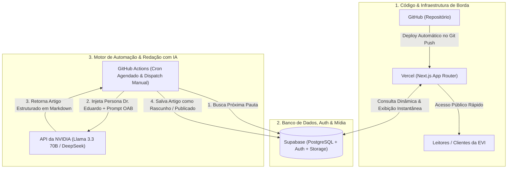
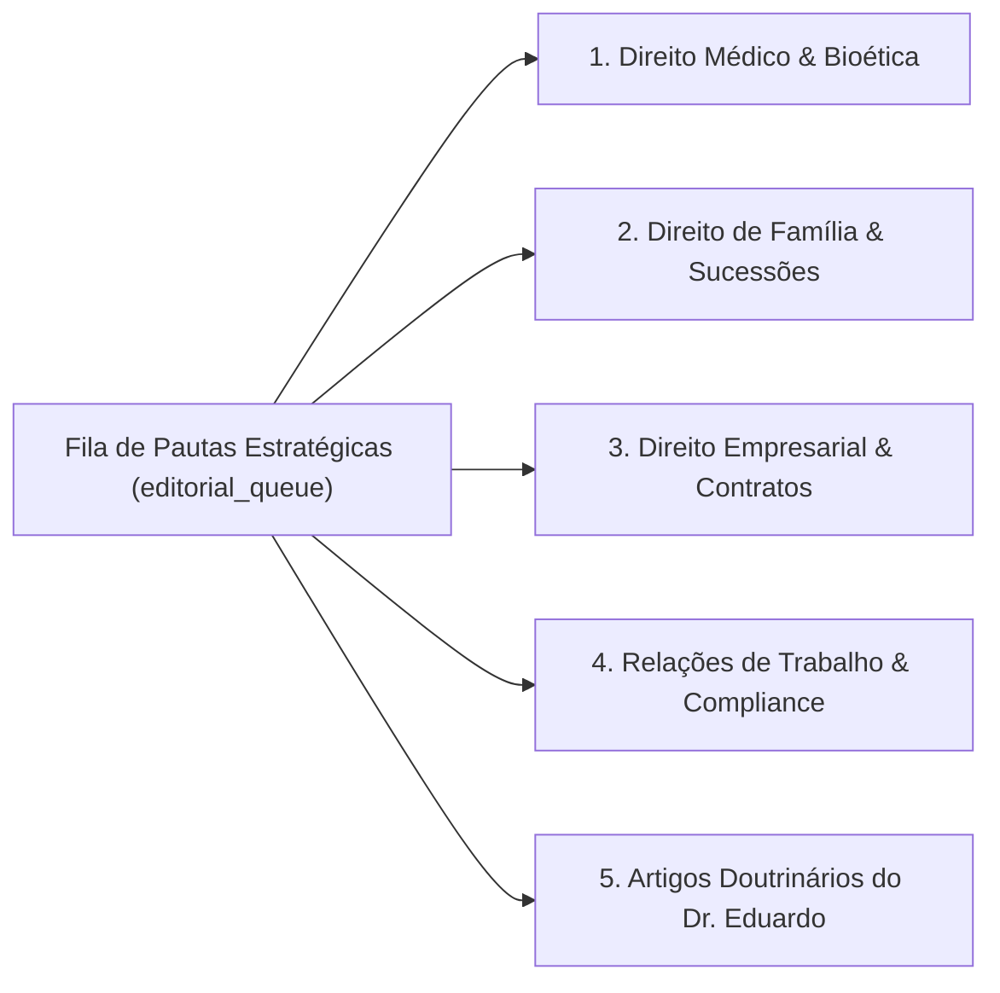
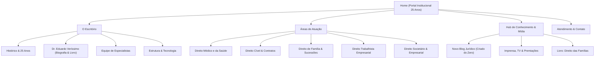
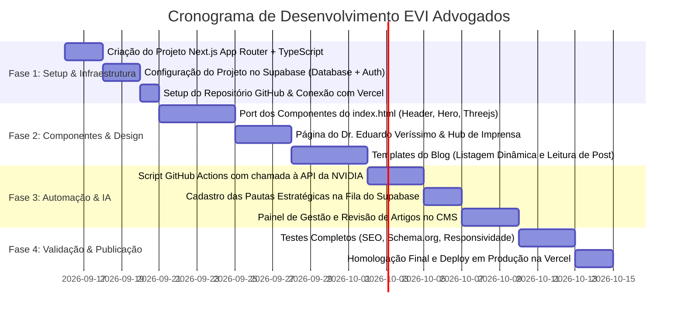

# Especificação Técnica e de Produto (SPEC): Plataforma Web EVI Sociedade de Advogados

**Arquivo:** `spec.md`  
**Cliente:** EVI Sociedade de Advogados  
**Liderança / Sócio-Diretor:** Dr. Eduardo Veríssimo Inocente  
**Status:** Arquitetura Aprovada & Pronto para Desenvolvimento  
**Versão:** 2.0 (Next.js na Vercel + Supabase + GitHub Actions + NVIDIA AI)  
**Repositório Oficial:** `https://github.com/ag-Codevision/evi_adv.git`  
**Banco de Dados & Auth:** Supabase PostgreSQL (`https://mrxvubobgujdzdyunsvp.supabase.co`)  
**Data:** Setembro de 2026  

---

## 1. Sumário Executivo & Visão Geral da Arquitetura

O projeto evolui do protótipo estático monolítico (`index.html`) para uma **Plataforma Web Jurídica Moderna, Escalável e Automatizada**.

A infraestrutura foi desenhada para oferecer **custo de operação zero**, performance máxima de carregamento (Core Web Vitals 100/100), segurança de dados corporativa e autonomia completa para o escritório por meio de inteligência artificial de ponta.

### 1.1. As 4 Peças Centrais da Arquitetura



---

## 2. Decisões Arquiteturais e Tecnologias Escolhidas

### 2.1. Frontend & Hospedagem: Next.js na Vercel
* **Framework:** **Next.js (App Router)** com React, TypeScript e Tailwind CSS integrado ao Design System prata/platina do [design.md](file:///f:/_CLIENTES/Evi%20Advogados/design.md).
* **Hospedagem:** **Vercel** (Integração Git nativa com deploys instantâneos a cada push).
* **Estratégia de Renderização:**
  * **Páginas Institucionais (Home, O Escritório, Áreas de Atuação):** Renderização estática ultrarrápida com hidratação leve (preservando o canvas Three.js da Hero e animações de scroll).
  * **Blog & Artigos:** *Incremental Static Regeneration (ISR)* com revalidação sob demanda (`revalidateTag`), fazendo novos artigos cadastrados no Supabase aparecerem instantaneamente no site sem exigir novos deploys de código.

### 2.2. Backend, Dados e Mídia: Supabase (PostgreSQL)
A substituição do SQLite local pelo **Supabase** resolve definitivamente a persistência em ambiente serverless:
1. **Banco Relacional:** PostgreSQL gerenciado de alta performance com tabelas estruturadas:
   * `posts`: Artigos do blog (título, slug, conteúdo em markdown, categoria, autor, status `draft/published`, metatags SEO).
   * `categories`: Categorias oficiais dos eixos temáticos jurídicos.
   * `authors`: Dados biográficos, títulos acadêmicos e foto (com destaque para o Dr. Eduardo Veríssimo).
   * `press_items`: Acervo de matérias de imprensa, entrevistas de TV, reportagens e premiações.
   * `editorial_queue`: Fila de temas e pautas estratégicas que a IA consome automaticamente.
2. **Supabase Auth:** Sistema de autenticação nativo e seguro para acesso ao painel do CMS pelo Dr. Eduardo e equipe (com login por e-mail/senha protegidos).
3. **Supabase Storage (Bucket S3):** Armazenamento em nuvem com CDN pública para fotos de capa dos posts, retratos oficiais e banners.
4. **Painel Visual Integrado:** Interface gráfica no navegador para visualizar e editar dados diretamente quando necessário.

### 2.3. Automação e Redação Inteligente: API da NVIDIA + GitHub Actions
* **Inteligência Artificial (LLM):** **API da NVIDIA (NVIDIA NIM)** utilizando modelos abertos de topo de linha como **Llama 3.3 70B Instruct** ou **DeepSeek R1/V3**.
* **Orquestrador sem Limite de Timeout:** **GitHub Actions** (`.github/workflows/generate-article.yml`).
  * **Por que GitHub Actions em vez do Vercel Cron?** Elimina qualquer risco de erro `504 Gateway Timeout`. A máquina virtual do GitHub pode executar com folga por vários minutos, enquanto a Vercel corta funções serverless no plano Hobby em poucos segundos.
  * **Frequência Agendada:** Execução configurável via Cron (ex: toda terça e quinta-feira às 09h da manhã).
  * **Disparo Manual (*Workflow Dispatch*):** Possibilidade de disparar a geração de um artigo com 1 clique direto no painel administrativo ou pelo GitHub.
* **Segurança de Credenciais:** A chave da NVIDIA (`NVIDIA_API_KEY`) e os tokens de acesso ao Supabase (`SUPABASE_URL`, `SUPABASE_SERVICE_ROLE_KEY`) ficam armazenados com criptografia de ponta nos **GitHub Secrets** e nas variáveis de ambiente da Vercel, nunca expostos no código.

---

## 3. Pilar Central de Autoridade: Dr. Eduardo Veríssimo Inocente

O novo site e o blog posicionam o sócio-diretor como a voz e a mente jurídica de referência nacional do escritório.

### 3.1. Dossiê de Credenciais para o Perfil
* **Sócio-Diretor e Titular:** Advogado com 25 anos de prática jurídica em todo o território nacional.
* **Formação:** Graduado e especialista em Direito Civil pela Universidade São Judas Tadeu (USJT).
* **Mestrado:** Mestre em Direitos Difusos e Coletivos pela UNIMES.
* **Titulação Internacional:** Diplomado no Seminário Internacional de Estudos em Ávila, na Espanha.
* **Magistério:** Professor de Direito em cursos de graduação e pós-graduação.
* **Autor de Livro de Referência:** *"Direito das Famílias Esquematizado – Teoria e Prática Processual"*.
* **Atuação Ética e Institucional na OAB:**
  * Ex-Instrutor do Tribunal de Ética e Disciplina da OAB/SBC.
  * Vice-Presidente da Comissão de Combate ao Exercício Ilegal da Profissão da OAB/SBC.

### 3.2. Presença na Mídia & Hub de Imprensa Integrado

| Veículo / Programa | Tipo de Mídia | Tema / Repercussão |
| :--- | :--- | :--- |
| **Band News** (*Empresários de Sucesso*) | Vídeo / TV | Entrevista sobre o modelo inovador de assessoria preventiva e contenciosa da EVI. |
| **Programa Tarde Top** (*Nani Venâncio*) | Vídeo / TV | Análise jurídica de direitos fundamentais e cidadania com o Dr. Eduardo. |
| **BCC International Television** (*Conversa Legal*) | Vídeo / TV | Debate exclusivo sobre *"Aspectos Legais da Barriga Solidária e Direito Reprodutivo"*. |
| **International Business Magazine** | Capa / Revista | Destaque editorial: *"Assessoria Jurídica Moderna e Inovadora é a marca da E.V.I."*. |
| **IB Magazine International** | Reportagem | Reconhecimento à competência técnica e liderança corporativa. |
| **Prêmio QUALITY JUSTIÇA (2019)** | Homenagem Oficial | Comprovação de responsabilidade social, ética e respeito às comunidades. |
| **Troféu Personalidade ABC** | Jornal Gazeta | Reconhecimento regional como liderança jurídica de destaque. |
| **Certificado IBI Membership** | Certificação Internacional | Membro titular do International Business Institute. |

---

## 4. Catálogo Editorial Estratégico (Pautas para a IA do Novo Blog)

O novo blog é construído **100% do zero**, sem importar arquivos de bancos legados. A tabela de pautas no Supabase (`editorial_queue`) conterá as seguintes linhas temáticas fundamentais:



### 4.1. Eixo 1: Direito Médico & Bioética
1. *Gestão Preventiva de Riscos na Prática Médica: Prontuários e Termos de Consentimento (TCLE).*
2. *Aspectos Legais da Reprodução Assistida e Barriga Solidária no Brasil.* *(Entrevista na TV)*
3. *Defesa Ético-Profissional em Sindicâncias e Processos nos Conselhos (CRM/CFM).*
4. *Responsabilidade Civil Hospitalar: Deveres da Instituição e Proteção do Corpo Clínico.*
5. *A Nova Regulamentação de Publicidade Médica pelo CFM nas Redes Sociais.*

### 4.2. Eixo 2: Direito de Família & Planejamento Sucessório
1. *Reconhecimento da Maternidade e Paternidade Socioafetiva e seus Efeitos Patrimoniais.*
2. *Alienação Parental: Meios de Prova, Medidas Protetivas e Jurisprudência Atualizada.*
3. *Pacto Antenupcial: Estratégias de Blindagem e Escolha Consciente do Regime de Bens.*
4. *Guarda Compartilhada, Residência Fixa e Fixação Equilibrada de Alimentos.*
5. *Holding Familiar e Planejamento Sucessório: Como Evitar o Desgaste do Inventário Judicial.*

### 4.3. Eixo 3: Direito Empresarial, Contratos & Recuperação de Crédito
1. *A Ordem de Preferência dos Credores em Ações de Execução e Cobrança Judicial.*
2. *Acordo de Sócios e Governança: Prevenindo a Dissolução Contenciosa da Empresa.*
3. *Revisão de Contratos Empresariais e Cláusulas de Desequilíbrio Econômico.*
4. *Adequação à LGPD na Saúde e no Ambiente Corporativo: Evitando Sanções da ANPD.*

### 4.4. Eixo 4: Relações de Trabalho & Prevenção Patronal
1. *Litigância de Má-Fé e Simulação em Reclamações Trabalhistas: A Resposta da Justiça.*
2. *Auditoria Preventiva Trabalhista: Identificando Passivos Ocultos antes do Processo.*
3. *Regulamentação do Teletrabalho e Modelo Híbrido: Controle de Ponto e Benefícios.*
4. *Prevenção ao Assédio Moral: Código de Conduta e Canal de Denúncias Interno.*

### 4.5. Eixo 5: Doutrina, Inovação & Opinião (Assinado pelo Dr. Eduardo Veríssimo)
1. *O Avanço da Inteligência Artificial no Direito: Oportunidades, Ética e Limites.*
2. *Reformas Legislativas e Constitucionais: Impactos na Sociedade e nas Famílias.*
3. *Casos Práticos do Livro "Direito das Famílias Esquematizado": Teoria e Prática Forense.*

---

## 5. Engenharia de Prompts para a API da NVIDIA

Para garantir que todos os artigos gerados pela IA tenham rigor técnico impecável e obedeçam integralmente às resoluções da OAB:

### 5.1. System Prompt Estruturado da EVI
```markdown
Você é o Consultor Jurídico Sênior e Ghostwriter de Conteúdo Institucional da EVI Sociedade de Advogados, redigindo sob a supervisão editorial do sócio-diretor Dr. Eduardo Veríssimo Inocente.

DIRETRIZES FUNDAMENTAIS:
1. Tom e Linguagem: Executivo, sofisticado, sóbrio, empático e de alta clareza didática (sem jargões jurídicos desnecessários).
2. Código de Ética da OAB: É TERMINANTEMENTE PROIBIDO fazer promessas de causas ganhas, divulgar valores ou utilizar técnicas comerciais agressivas de vendas. O conteúdo é estritamente informativo, preventivo e orientador.
3. Formatação: Entregar o artigo formatado em Markdown limpo (H1 envolvente, introdução cativante, 3 a 4 subtítulos H2 aprofundados, jurisprudência recente sintetizada e conclusão reflexiva).
4. Fechamento Institucional: Incluir nota ética convidando o leitor a sanar dúvidas pontuais com a equipe da EVI Sociedade de Advogados.
```

---

## 6. Arquitetura de Informação & Mapa do Site (Sitemap)



---

## 7. Fidelidade Visual ao Design System (`design.md`)

O novo projeto preservará cada decisão estética já homologada em [design.md](file:///f:/_CLIENTES/Evi%20Advogados/design.md):
1. **Paleta Prata/Platina Obrigatória:** `--deep` (`#18283a`), `--accent` (`#728699`), `--silver` (`#b8c7d6`), `--silver-bright` (`#e2e8f0`) e `--soft` (`#f1f4f6`). Jamais usar tons dourados ou ocres.
2. **Tipografia Serifada de Prestígio:** `var(--serif)` (*Georgia / serif*) na barra de navegação (`.nav-item`), títulos principais `H1`, subtítulos de seção `H2`, títulos dos cards `H3` e cabeçalhos de artigos.
3. **Menubar Simétrica Centralizada:** Logotipo EVI centralizado (`54px` / `42px` no scroll) ladeado simetricamente por 2 links à esquerda e 2 à direita com espaçamento harmônico de `52px`.
4. **Rodapé Estável:** Caixa de logotipo em branco puro com cantos de `10px` e sombra sutil, sem animação no `.footer-bottom` para impedir que o copyright vaze da barra escura.

---

## 8. Plano de Execução do Desenvolvimento



---

## 9. Prontidão para Início Imediato

Com o documento `spec.md` formalmente consolidado e alinhado, estamos prontos para iniciar o desenvolvimento da **Fase 1: Setup do Projeto Next.js, Banco de Dados no Supabase e Repositório GitHub conectado à Vercel**.
